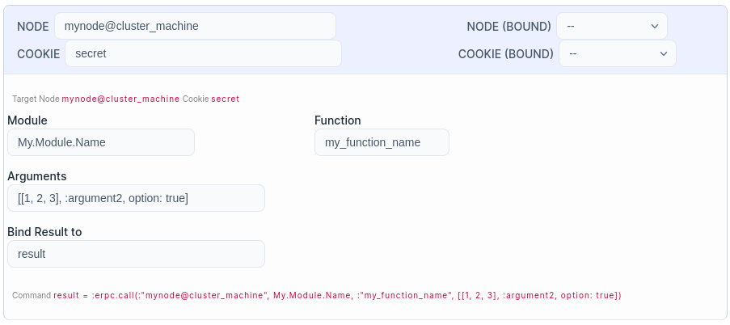

# ClusterConnectSmartcell

`ClusterConnectSmartcell` is a smart cell for [Elixir Livebook](https://livebook.dev) that allows
connecting to a remote node in an Elixir cluster and optionally send a `:erpc` call.

## HowTo

### Installation

The package is published in [hex](https://hex.pm/) and you can use it in your livebook setup section as

``` elixir
Mix.install([
  # ...
  {:cluster_connect_smartcell, "~> 0.0.1"}
  # ...
])
```

otherwise you can test the bleeding edge directly via github

``` elixir
Mix.install([
  # ...
  {:cluster_connect_smartcell, git: "https://github.com/zoten/cluster_connect_smartcell", ref: "master"}
  # ...
])
```

### Usage

You will need:

 * 📖 a running Livebook
 * 🏝️ a running node running with a `sname` you can reach. See [Erlang distribution](https://www.erlang.org/doc/reference_manual/distributed.html) documentation and have fun :)
 * 🥋 optionally, a command you want to trigger on the remote node 
  
Once [installed](#install) dependencies and added with the `+ Smart` button the smart cell, you should see something like



Fill in the relevant parts and you should be good to go! Please note that:

 * if any of the `Module`, `Function` or `Arguments` is empty, no `:erpc` will be performed
 * at the moment `Arguments` shall be a manually crafted list. The screenshot in example will result in a call like

    ``` elixir
    :erpc.call(:"mynode@cluster_machine", My.Module.Name, :my_function_name, [[1, 2, 3], :argument2, option: true])
    ```
  
    that will call `My.Module.Name.my_function_name/3` as

    ``` elixir
    My.Module.Name.my_function_name([1, 2, 3], :argument2, option: true)
    ```

## Why?

Because I was preparing a learning tool for my colleagues and wondered how hard could it be to 
write a smartcell for it (spoiler: not *so* hard! 🚀)

### When is this useful?

When you want to have the ability to use livebook's goodies (e.g. graphs and charts) but they are not available in the remote node's runtime, and you don't want those runtime dependencies

### How?

See [Sources](#sources) to see where the inspiration (and a lot of code) came from.
Please note I don't know any Vue at the moment, so be patient. I'm also very bad at styling, among the rest.

## Notes

### Gotchas

 * Livebook process starts only as a `sname` node, so keep this in mind when connecting to a cluster
 * creating the `:erpc` call means creating atoms where they may not exist in the context of the process running the livebook. You probably know [what it means](https://www.erlang.org/doc/efficiency_guide/advanced.html) for the BEAM
 * calling a `:erpc` means giving the caller total freedom on the target machine BEAM environment. Please, be aware of that and give access only to trusted people
 * connection to the cluster via erlang distribution is subject to all of a series of attacks and problems you should be aware of before using this for any production use case

### TODO

 * tests. I know, I should have TDD'ed or something like that, but I really don't know how to test a smartcell right now, nor I wanted to set up cluster testing   in the limited time I had to set up this
 * more features (in random order)!
    * ~~binding with variables created in livebook's context to use as arguments~~
    * make the argument list a `arg0`, `arg1`, ... dynamic list instead of relying on the user to set up correctly a list of arguments
    * cluster connection types (`:hidden`, etc)
    * node list retrieved from epmd (for local usage) and after connection
    * connection status indicator
    * make `cookie` field a password field
    * allow also non-`Elixir.` prefixed modules (-> allow connecting and `:erpc`-ing to erlang nodes)
 * set up some sort of CI

### Contributing

> Please note this is still a `draft` kind of project, that's why it is still `< 0.1.x`. However, any help is appreciated from the start!

Feel free to reach me via any means or directly file an issue/PR!
### Sources

If the use of any of those sources has been deemed inappropriate by the author(s), please feel free to contact me by any means and I'll take proper actions

 * [main.css](./lib/assets/cluster_connect_smartcell/main.css) is almost totally copied from wonderful [kino_vega_lite](https://github.com/livebook-dev/kino_vega_lite/blob/02d9220f1c82e2e1848f15a800d187a50c2fdc02/lib/assets/chart_cell/main.css)'s chart_cell original work
 * [main.js](./lib/assets/cluster_connect_smartcell/main.js) and assets loading is totally based on from wonderful [kino_vega_lite](https://github.com/livebook-dev/kino_vega_lite/blob/02d9220f1c82e2e1848f15a800d187a50c2fdc02/lib/assets/chart_cell/main.js)'s chart_cell original work

Any idea on how to make this appropriation more explicit is welcome!
